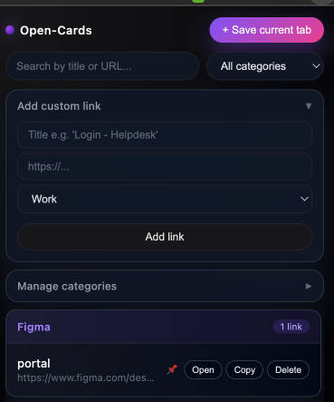

# Open-Cards  
A premium dark-themed Chrome extension to save, organize, and instantly access your most important work links — tickets, Figma files, dashboards, login pages, PRs, daily tools, and more.


## 🚀 Features

- Save current tab instantly as a smart card
- Categorize links (Tickets, Figma, Work, Daily Tools, Personal, Others)
- Add manual links with custom title + category
- Pin important cards to keep them on top
- Search & filter by keyword or category
- Auto-sync across Chrome via Storage Sync
- Minimal, premium dark UI

## 🎨 UI Preview




## 📦 Installation (Developer Mode)

1. Clone the repository:
   ```
   git clone repo
   ```
2. Go to:
   ```
   chrome://extensions
   ```
3. Enable Developer Mode  
4. Click **Load Unpacked**  
5. Select the extension folder  

## 🗂 Project Structure

```
open-cards/
│── manifest.json
│── popup.html
│── popup.js
│── popup.css
│── assets/
│     └── icons/
```

## 🛠️ Development

Make changes → Refresh extension

## 📜 License

MIT License © 2025
